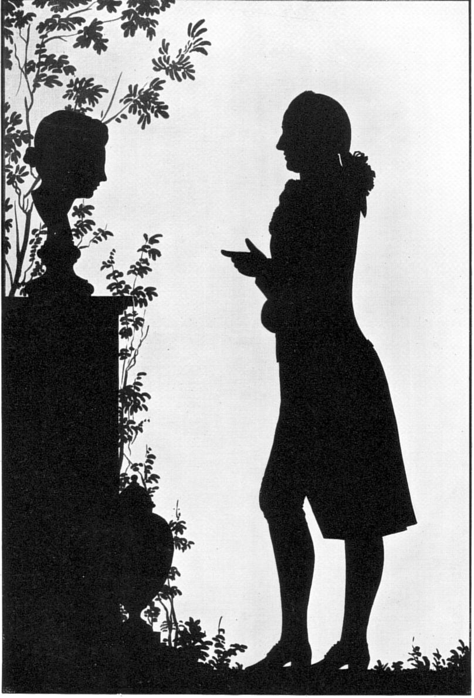
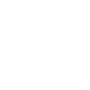
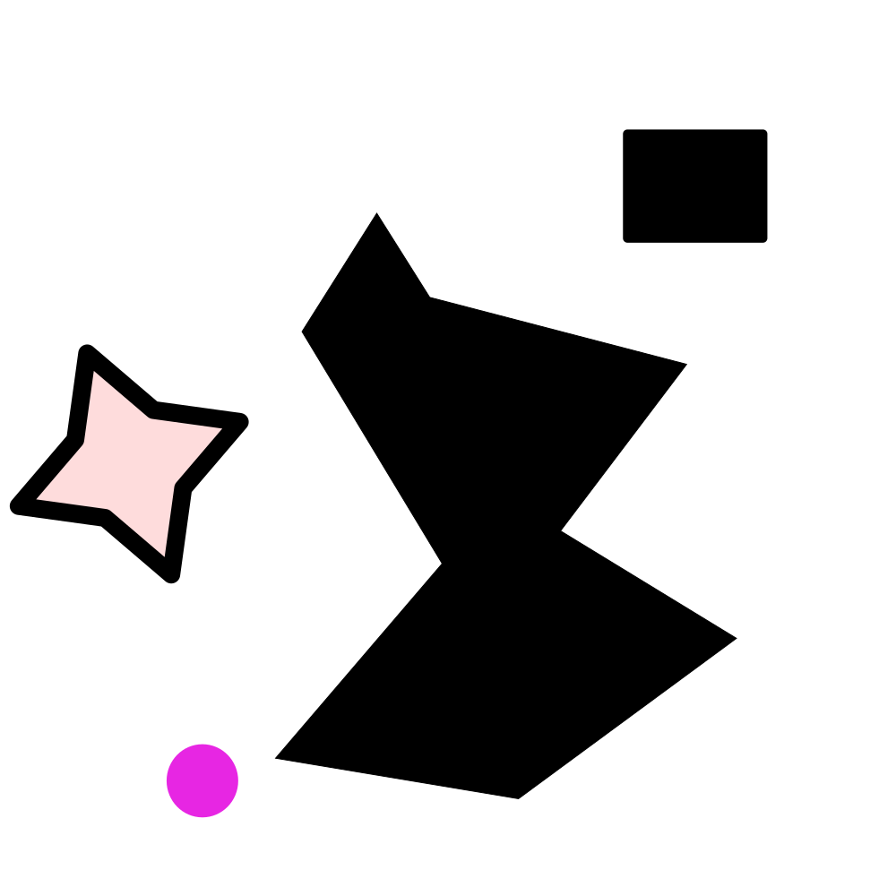
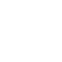
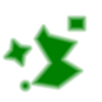
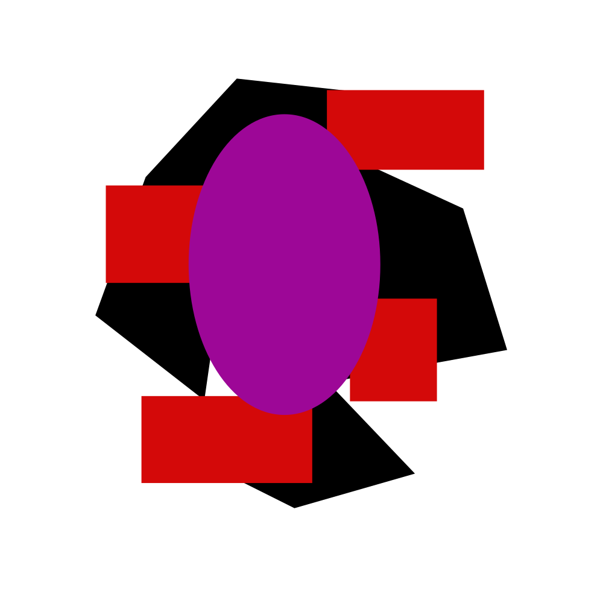
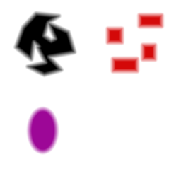
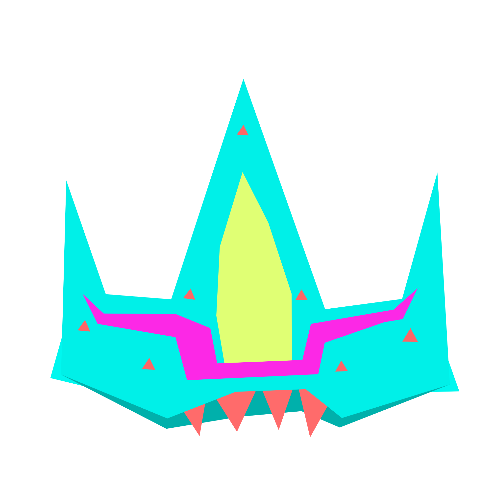
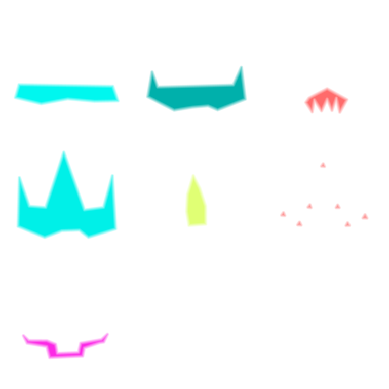

# PYthon SDF convertER

Given an image containing a shape, converts into an CSDF texture

Has two main modes: normal image, and inkscape document.

When used on a normal image (png, svg without --inklayers, etc) it expects a
black shape on a white background. When a directory of images is indicated 
instead of a single image, the --atlas flag can be used to generate an 
atlas of all of the textures.

When used on an inkscape document with --inklayers, generates a csdf texture for
each layer, using extension ".csdf.png". If the --atlas flag is used with 
the --inklayers flag, either on a single image or a directory, an atlas will 
be created for each image, using the layers contained within. If the inkscape 
document has an extension .ink.svg or .plain.svg, a new folder will be created 
using the name of the document.

The default output directory is ./sdf_out, which can be changed with --path-out

## CSDF

Unlike traditional SDF texture encoding strategies where field information is
stored in a single greyscale channel, this application encodes that information
in the alpha channel of an image and stores color information using the 
appropriate color channels. This allows for simpler and more universally 
applicable materials to be created and utalized, and it allows for artists
to edit the generated CSDF images to add additional patterns and stylizations.
This application currently only stores one color per individal SDF, but 
will likely be extended later to allow for richer and more varied options.

This program can also generate atlases of multiple CSDFs, either from individual
images in a directory or from layers of an inkscape document. In addition to 
the normal benefits of atlassing, this allows composite colored SDF shapes to be 
created using a single image and a single material. Like with traditional 
SDF textures, additional effects can be layered easily. While this does usually
result in a larger on-disk file then an SVG image, in instances where svgs
must be rasterized before use in rendering the resulting VRAM usage should 
be substantially less, as svgs need to be rasterized at a very high resolution
to remain sharp.

## Installation

pysdfer.py stands on its own once its [requirements](#requirements) are installed, meaning that 
copies of it can live quite happily in project directories.

If using nix flakes (and Inkscape is installed), can be ran via 
`nix run github:zaphodious/pysdfer` (and included in development flakes 
in the usual way).

## Example usage

Example evocations from [genexamples.sh](./genexamples.sh)

`./pysdfer.py ./examples/Goethe.jpg`

(From [Wikipedia](https://en.wikipedia.org/wiki/File:GoetheVorEinemGrabmalMitWeiblicherBuesteS92.jpg))

| Original Image                               | Output                                               |
| --------------                               | ------                                               |
<<<<<<< HEAD
|  |  | 
=======
|  |  | 
>>>>>>> 6edea719684e415ddf62edadae7dc3f1d5e5054d

`./pysdfer.py ./examples/one_layer.ink.svg `

| Original Image                               | Output                                               |
| --------------                               | ------                                               |
|  |  | 

`./pysdfer.py ./examples/one_layer.plain.svg --main-color green`

| Original Image                               | Output                                               |
| --------------                               | ------                                               |
|  |  | 

`./pysdfer.py --inklayers --atlas ./examples/multi_layer.ink.svg `

| Original Image                               | Output                                               |
| --------------                               | ------                                               |
|  |  | 

`./pysdfer.py --inklayers --atlas ./examples/shiptest.svg --height 256`

| Original Image                               | Output                                               |
| --------------                               | ------                                               |
|  |  | 

`./pysdfer.py ./examples --inklayers --path-out ./examples/sdf_out/bulk_inklayers`

[Example Directory](./examples/) -> [Output Directory](./examples/sdf_out/bulk_inklayers/)


Output of --help

```
sage: pysdfer.py [-h] [--path-out PATH_OUT] [--main-color MAIN_COLOR] [--color-underlay COLOR_UNDERLAY] [--inklayers] [--atlas]
                  [--processes PROCESSES] [--height HEIGHT] [--keep-aspect]
                  path_in

Makes SDF textures. See README.MD for usage examples.

positional arguments:
  path_in               The path for the file or directory to process. Will process each file in the directory. Must exist.

options:
  -h, --help            show this help message and exit
  --path-out PATH_OUT   Path for the destination file or folder. If the path-in is a folder or --inklayers is used, path-out must be
                        a folder. Defaults to being an /sdf_out directory in the source dir
  --main-color MAIN_COLOR
                        The color that the resultant image will be. If none is provided, will default to 'white'
  --color-underlay COLOR_UNDERLAY
                        Color over which the source image will be placed before the sdf conversion. Defaults to 'white'. To keep
                        transparency, use --color-underlay transparent. If the conversion results in weirdness, try setting this to
                        the opposite of the shape's color
  --inklayers           If the image is an inkscape svg (or there are svgs in the folder), it will convert each layer as its own
                        seperate sdf image. It will then use the color of (the most) shapes in the layer as that layer's main color
                        unless another main color is explicitely provided. Use of this command means that non-svg files will not be
                        processed if a directory path is given. Has no effect if the path is to a png file. Cannot be used with
                        --no-svg
  --atlas               Takes a collection of images, and puts them into an atlas. The images themselves should all be the same w:h
                        ratio, and the atlas will be the same number of images wide as it is tall (filling the empty space with
                        transparency). If --inklayers is enabled, then one atlas will be made for each inkscape document, rather
                        then one that includes all of the images in the folder
  --processes PROCESSES
                        Sets the number of processes for the command to use. Defaults to 10.
  --height HEIGHT       The height dimension of the individual sdf image.
  --keep-aspect         Normally, the script coerces the output into a square. This makes the script not do that.
```

## Requirements 

In addition to the stuff in [requirements.txt](./requirements.txt), ImageMagick
and Inkscape need to be installed. 

If using the flake note that Inkscape is not provided, and must be installed seperately.
